# Exploratory Data Analysis of Clothing Dataset

## Python Libraries Used
1. Pandas (data analysis)
2. sklearn (count vectorizer)
3. plotly (visualization)
4. textblob (polarity calculation)


## Original Data

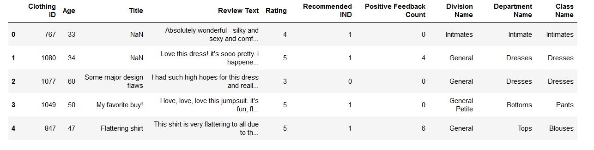


Features                                       |   Description
:---------------------------------------------:|:-------------------------:
Clothing ID                                    |   Unique Key
AGE                                            |   Age of Reviewers
Title                                          |   Title of Text
Review Text                                    |   Reviews
Rating                                         |   Ratings by reviewers
Recommended IND                                |   Recommended or not
Division Name                                  |   Name of Product Division
Department Name                                |   Product Departments
Class Name                                     |   Class of Products


## Data after preprocessing

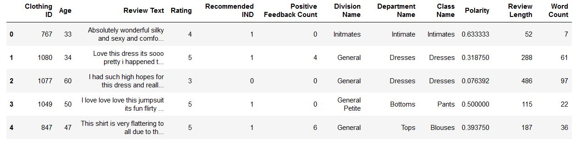


Features                                       |   Description
:---------------------------------------------:|:-------------------------:
Polarity                                       |  Sentiment score of Reviews 
Review Length                                  |  Length in characters of Review
Word Count                                     |  Number of words in Review

## Top Five Positive Reviews with highest Polarity

```
positive_text = df[df['Polarity']==1.0]['Review Text'].head()
for i in positive_text:
    print(i)
```
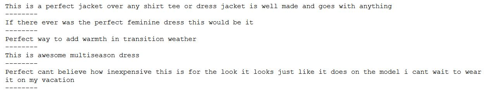

## Top Five Negative Reviews with lowest Polarity

```
negative_text = df[df['Polarity'] <= -0.6]['Review Text'].head()
for i in negative_text:
    print(i)
```
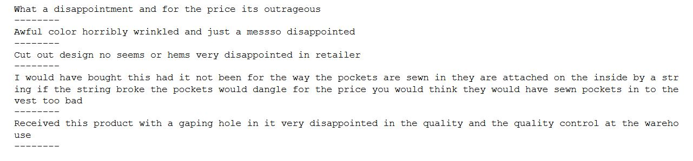

## Percentage of Positive, Negative and Neutral Reviews
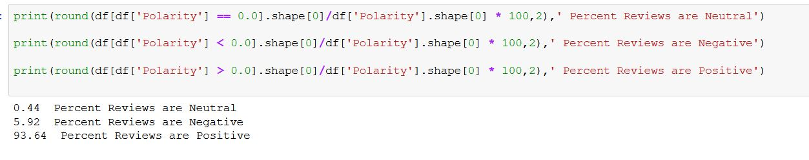

## Polarity Distribution
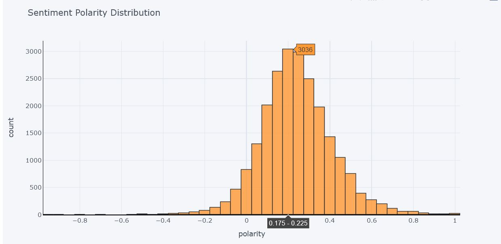

Clearly the data is very unbalanced in terms of Polarity as 94% of reviews are Positive or Neutral and only 6% of reviews are Negative. This fact is supported with the percent calculation done in previous step. 
Also evident from Polarity distribution graph that most of the reviews are either Neutral or Positive because distribution of graph is maximum between 0 and 0.4 There are a very few Negative reviews.

So here we can conclude that there is a high posibility that the Ratings distribution will be more towards 4 and 5. To prove this, let's plot distribution of Ratings 

## Distribution of Ratings

```
df['Rating'].iplot(
    kind='hist',
    bins=5,colors = '#0a7f87',
    xTitle='Ratings',
    linecolor='black',
    yTitle='count',
    title='Distribution of Ratings')
```
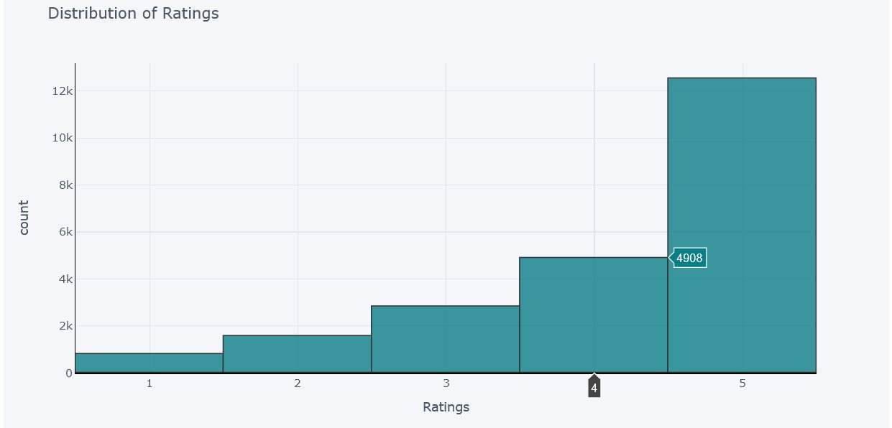

## Age Distribution of Reviewers
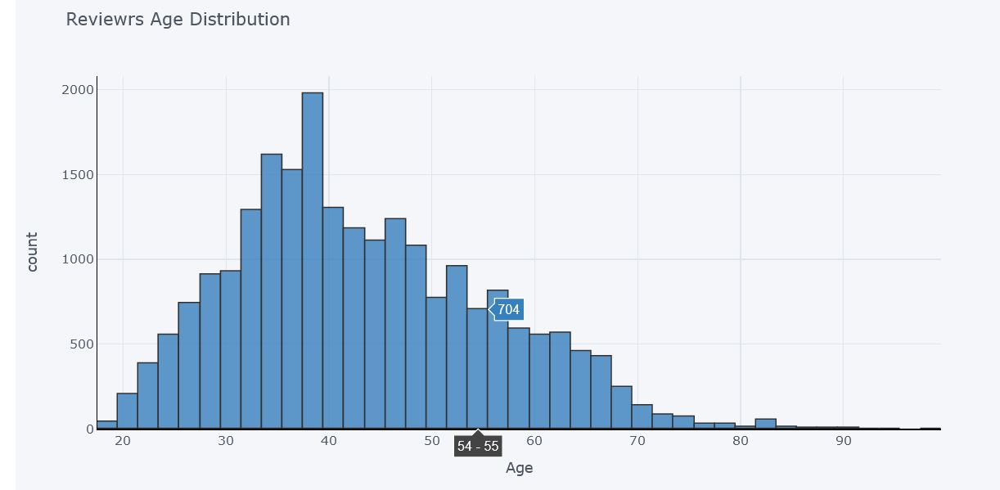

Most Reviewrs are of age between 30 to 45 and maximum are of age 38-39. As the distribution is more between this range. Many reviewers with age more than 80 are also there. There are 2 whose age is 99, these may be outliers but we do not have any evidence as now every age group people have access to internet and are free to provide feedback. 

## Distribution of Length of Reviews
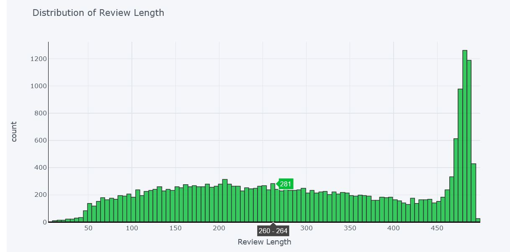

There are a lot of people who writes long reviews as more than 5000 people have written reviews of length more than 450 words. Also there are people who have written reviews in less than even 50 words.

## Distribution of Word Counts
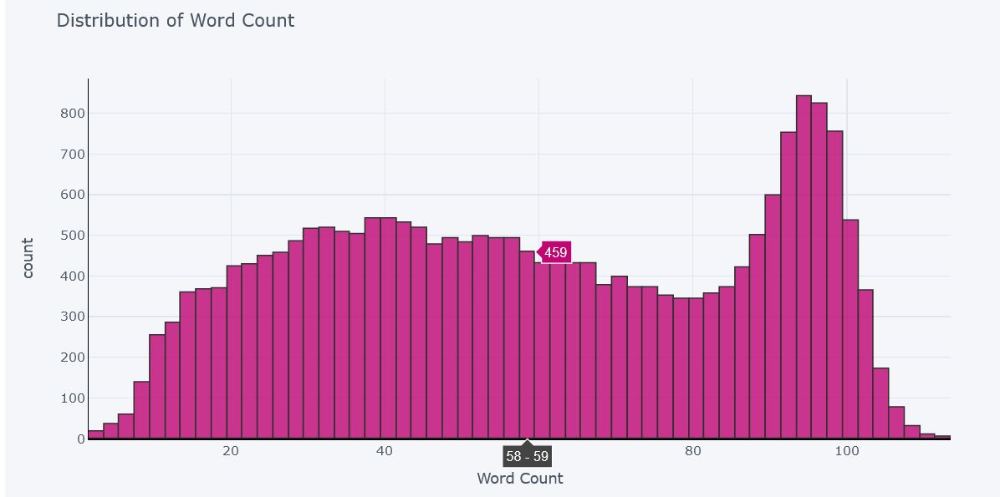

## Count of each Division
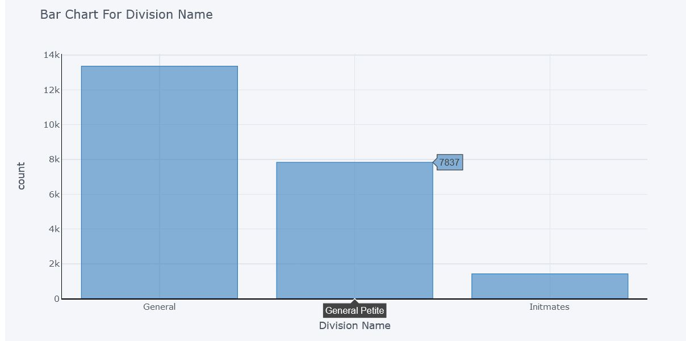

There are 3 divisions of cloths. Count of *'General division'* is more than 13000, count of *'General Petite'* is almost 8000 and *'Initmates'* division are with least count of 1400.

## Count for each Department
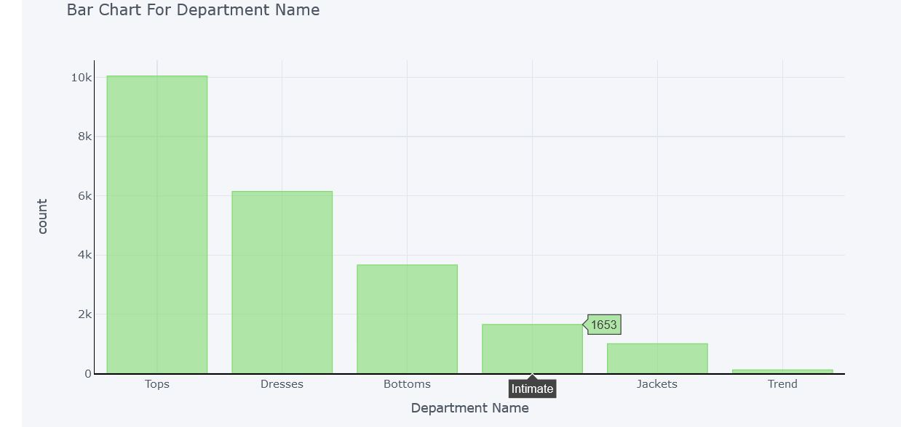

Here Cloths are divided into 6 departments. Count of Tops department is maximum with 10000 articles and Trend department's count is minimum with only 118 articles. So the reviews are maximum for top wears such as T-shirts, shirts, jackets, sweaters and girls stuffs. It can be concluded that most of the people buy Top wears, followed by dresses and bottom wears.

## Count of each Class
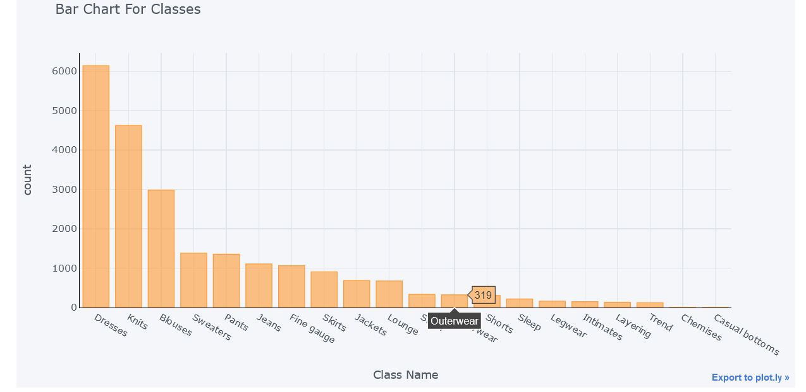

## Unigrams Before removing Stop Words

```
def top_words_no_stop(data, n):
    
    cv = CountVectorizer().fit(data)
    bag_of_words = cv.transform(data)
    sum_of_words = bag_of_words.sum(axis=0) 
    freq = [(word, sum_of_words[0, idx]) for word, idx in cv.vocabulary_.items()]
    freq =sorted(freq, key = lambda x: x[1], reverse=True)
    return freq[:n]

top = top_words_no_stop(df['Review Text'], 20)
```
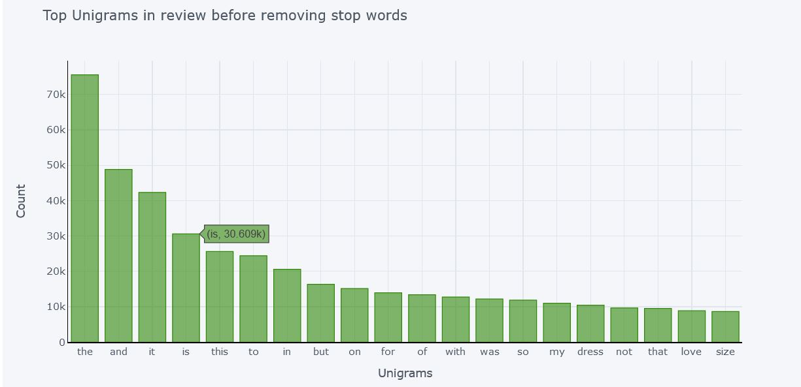

Unigram means single words. Here is the count of Top 20 single words appeared in reviews. Most of these are stop words that is are not relevent to decide polarity in text. We need to remove these words so that we can get actual significant words that contributes in deciding the polarity of text.

## Unigrams After removing Stop Words
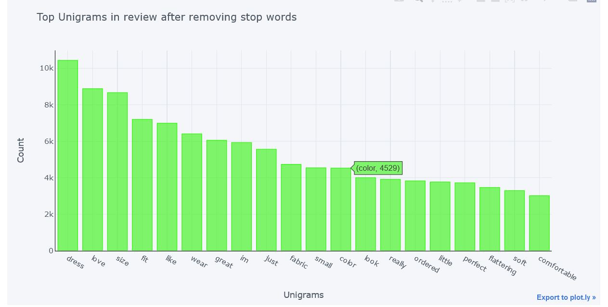

After Removing Stop Words we get the actual significant words from reviews. As evident from graph there are no stop words present in the list of words with maximum counts.

## Bigrams Before removing Stop Words
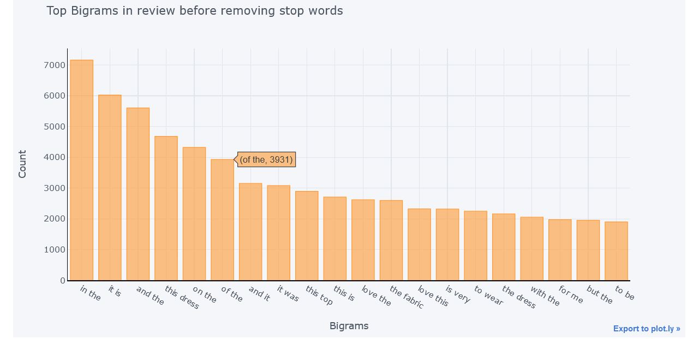

Bigrams are combination of two words that appear together. Here the stop words are not removed and most of bigrams here contains stop words. So again as done unigrams we will remove the stop word to get actual significant word and plot them

## Bigrams After removing Stop Words

```
def bigram_top_words_with_stop(data, n):
    
    cv = CountVectorizer(stop_words = 'english',ngram_range=(2,2)).fit(data)
    bag_of_words = cv.transform(data)
    sum_of_words = bag_of_words.sum(axis=0) 
    freq = [(word, sum_of_words[0, idx]) for word, idx in cv.vocabulary_.items()]
    freq =sorted(freq, key = lambda x: x[1], reverse=True)
    return freq[:n]

top = bigram_top_words_with_stop(df['Review Text'], 20)
```
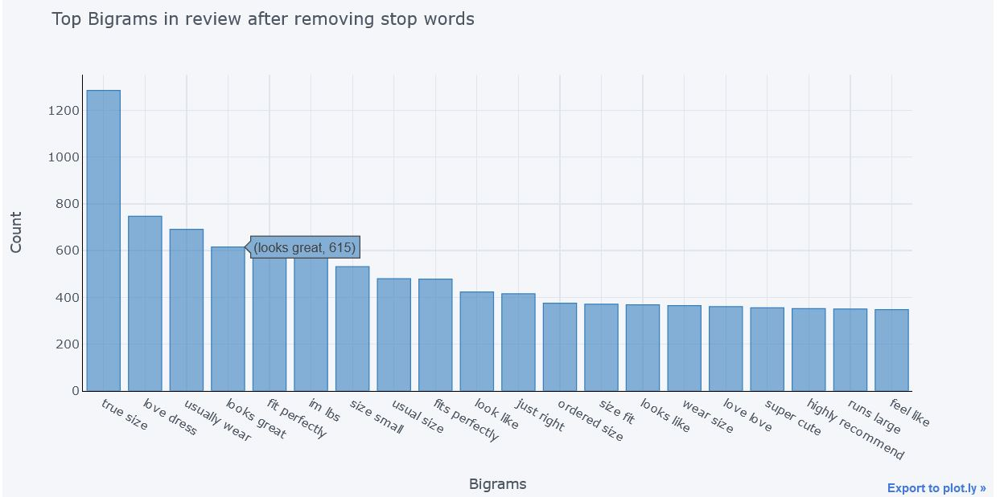

## Sentiment Polarity for Department Name
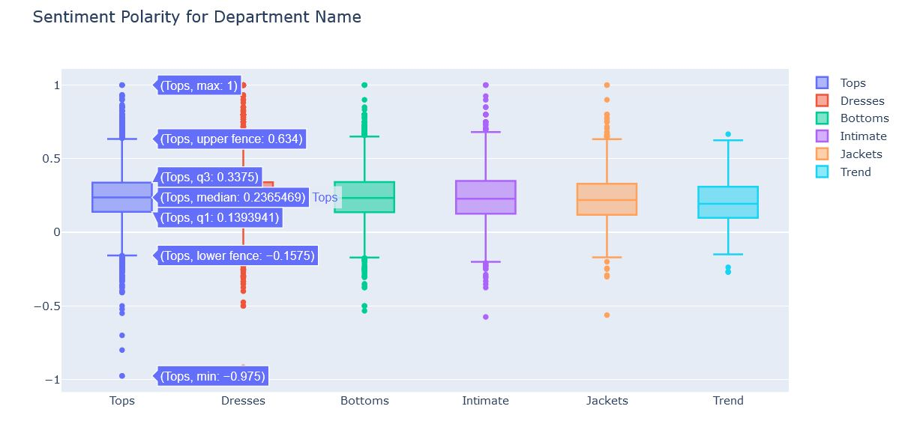

These are the box plots showing polarity for each department. That is how polar the reviews are or what people reviewed about each department. 
1. For Tops department most of the reviews are positive and only a few of them are negative. But as compared with other, Tops department have maximum number of negative reviews and the most negative comment is also for Tops.
2. Now Dresses department have almost same distribution as Tops.
3. Bottoms department have less number of Negative reviews as compared to Tops and Dresses but positivity range is almost same.
4. Intimate department have almost same distribution as Bottoms.
5. Jackets reviews are even less negative than Bottoms but there positivity range is also less.
6. Trend being the less reviewed among all departments have only a couple of negative reviews and its positivity range is also least among all.

So from this distribution also we can conclude that most of the reviews are positive and only a few are negative (As concluded in earlier distributions).

## Rating for Department Name
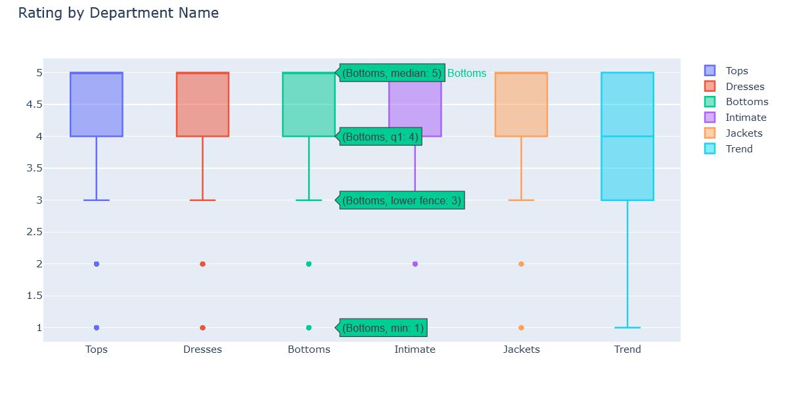

This is Ratings distribution based on departments. 5 departments - Tops, Dresses, Bottoms, Intimate, Jackets have exactly the same distribution. Maximum rating Between 3 to 5. That is products in these departments satisfied the people. Also most of the ratings are either 4 or 5.

Trend department however have different story. Many reviews are even rated 1 or 2 in this department and 25 percent of reviews are rated as 3. This makes it the worst rated department.

## Polarity of Reviews based on Recommendations
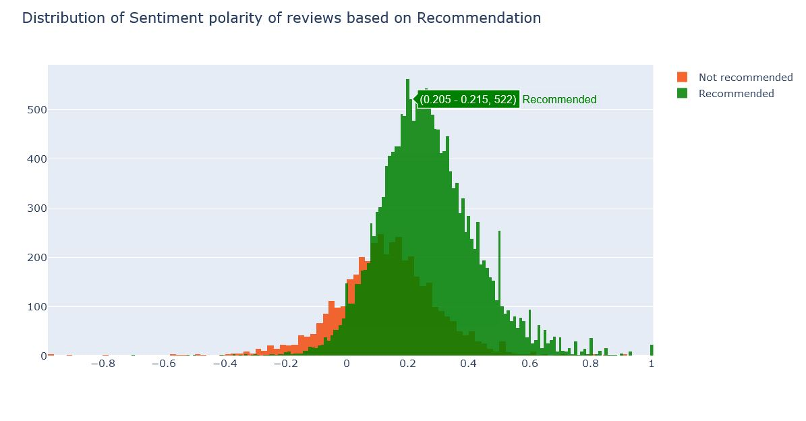

This is a polarity distribution based on recommendation. That is how much people have recommended the products to others. So here products with positive reviews are also not recommended by people and many products with negative reviews are recommended. That is -

```
Range of Recommended       :   -0.2 to 1.0

Range of Not Recommended   :   -0.6 to 0.6 
```

## Rating of Reviews based on Recommendations
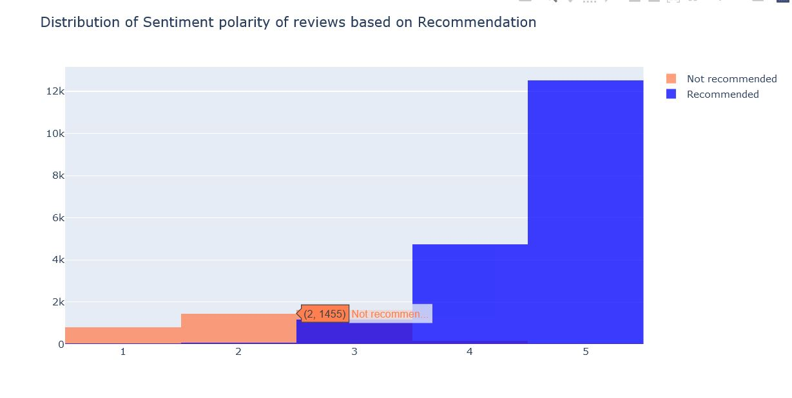

## Conclusion
1. 94% of Reviews are either positive or neutral
2. 6% of Reviews are negative
3. Supporting above points, most of the product ratings are either 4 or 5
4. Cloths are divided into 6 departments with Tops having maximum number of products and Trend having minimum.
5. Most of the people bought Top wear like T-shirts, shirts, jackets, sweaters etc
6. Products in Trend department are the worst rated.
7. Even products with positive reviews were not recommended by people and many products with negative reviews were recommended.
8. All the 5 rated products were recommended. Many 1 and 2 rated products were also recommended by people.
